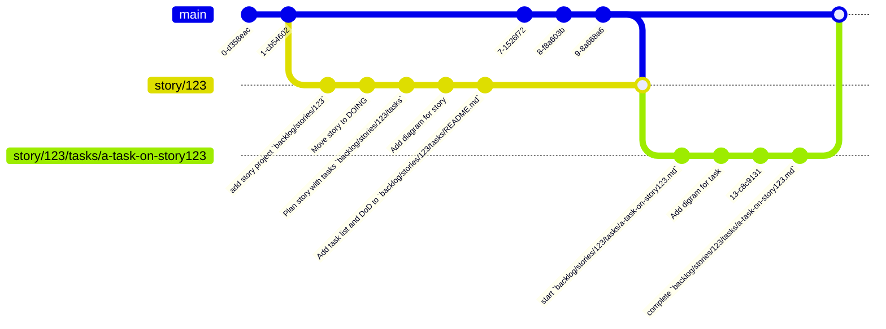
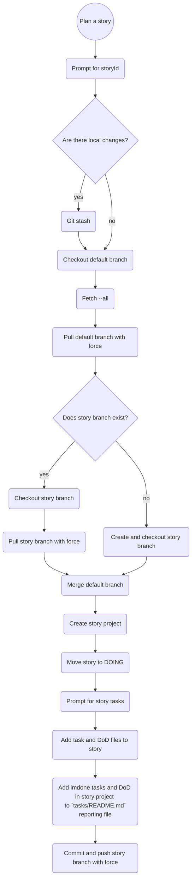

## #DOING Plan a story
As a developer I would like to plan a story and make it visible by adding tasks to a story markdown in my repo
- [x] Set default branch (Ask on init)
- [x] Set working remote (Ask on init)
- [x] Rename `import` to `plan`
- [ ] Implement git automation
  1.  Fetch from working remote
  2.  Checkout default branch
  3.  Checkout or create story branch
  4.  If it's not a git repo ask to init
- [ ] Add the story project
- [ ] Move the story task to DOING
- [ ] When we ask for tasks automatically add the DoD, so the user can delete ones that aren't relevant
  - [ ] Ask for story id
  - [ ] Ask for story description
  - [ ] Ask for tasks with inquirer 
- [ ] Generate task list in a tasks README: `backlog/stories/<story-id>/tasks/README.md`
  - Put a comment at the top of the file that say's it's autogenerated
  - Each task should have a relative path link back to task file it came from
- [ ] Commit and push the story branch with force
**{{line}}**
<!--
#story
created:2023-10-08T15:06:13.331Z
task-id:BSgB3
story-id:Plan-a-story order:0
-->

## Plan a story

## Plan a story flow
