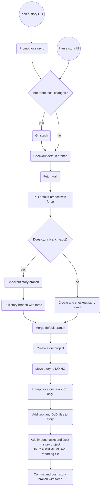

# #DOING Plan a story
<card>

As a developer I would like to plan a story and make it visible by adding tasks to a story markdown in my repo

## Tasks

- [x] Set default branch (Ask on init)
- [x] Set working remote (Ask on init)
- [x] Rename `import` to `plan`
- [x] Implement git automation
  1.  Fetch from working remote
  2.  Checkout default branch
  3.  Checkout or create story branch
  4.  If it's not a git repo ask to init
- [x] Add the story project
- [x] Move the story task to DOING
- [ ] Commit and push the story branch with force

## Later Stories

### Convert a card with tasks to a story and tasks
  - [ ] `task.text` is storyId if `story-id` meta is not set
  - [ ] First paragraph is story content
  - [ ] Process tasks in the same way as command line

### When we ask for tasks automatically add the DoD, so the user can delete ones that aren't relevant
  - [ ] Ask for story id
  - [ ] Ask for story description
  - [ ] Ask for tasks with inquirer 

### Generate task list in a tasks README: `backlog/stories/<story-id>/tasks/README.md`
  - Put a comment at the top of the file that say's it's autogenerated
  - Each task should have a relative path link back to task file it came from
<!--
#story
created:2023-10-08T15:06:13.331Z
task-id:BSgB3
story-id:Plan-a-story order:0
-->
</card>

## Plan a story


## Plan a story flow


## Convert a card with tasks to a story with tasks

- `task.text` becomes story title
  - if `story-id` meta is not set, the `task.text` is used as `story-id`
- First paragraph is story content
- Process tasks in the same way as command line
- Regenerate tasks from files in `tasks` every time one changes
- disable check in UI

```markdown
This is the story title

This is the story description

## Tasks

- [ ] Ungrouped task a
- [ ] Ungrouped task b
- [ ] Ungrouped task c

### Group 1

- [ ] Group 1 task a
- [ ] Group 1 task b
- [ ] Group 1 task c

### Group 2

- [ ] Group 2 task a
- [ ] Group 2 task b
- [ ] Group 2 task c

<!-- use title as story-id if it's falsy -->
```